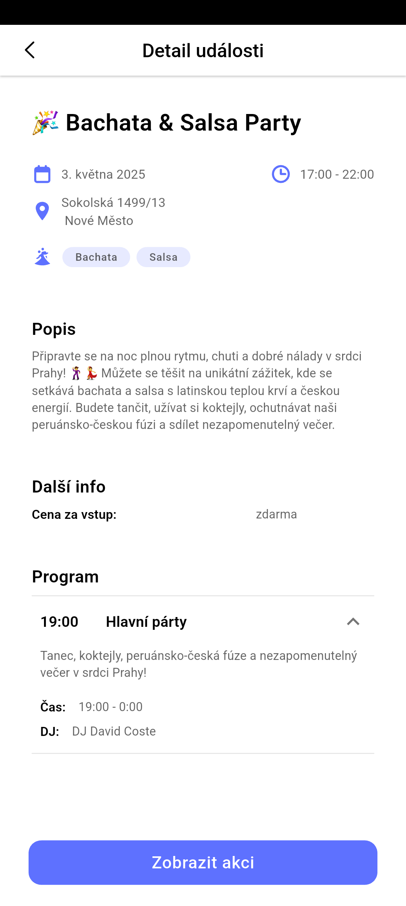

# Dancee
Running example is [here](https://dancee-app-silent-violet-46.fly.dev/). 
Design in Figma is [here](https://www.figma.com/design/sFohSyjLPAMvOACZK7JjJu/Dancee?node-id=2035-13171&p=f).

## Features
- Show list of events
- Show event details
- Parsing events from Facebook
- Generate event descriptions with TogetherAI

## Special thanks

Packages:
- [Dart](https://dart.dev/): Client-optimized language for fast apps on any platform.
- [Flutter](https://flutter.dev/): UI toolkit for building beautiful, natively compiled applications for mobile, web, and desktop from a single codebase.
- [Vader](https://github.com/mjablecnik/vader_framework): Full-stack Application Framework in Dart.
- [Serinus](https://serinus.app): Backend framework for Dart.
- [facebook-event-scraper](https://github.com/francescov1/facebook-event-scraper): Scraper for Facebook events in TypeScript. 
 
Services:
- [Figma](https://www.figma.com): Popular cloud-based design and prototyping tool used primarily for creating user interfaces (UI) and user experiences (UX)
- [Together.ai](https://www.together.ai): Provides a comprehensive cloud platform for developing, fine-tuning, and deploying generative AI models.
- [SurrealDB](https://surrealdb.com): SurrealDB is an open-source, multi-model database designed to simplify modern application development.
- [Fly.io](https://fly.io): Developer-centric cloud platform designed to simplify the deployment of applications close to users worldwide.
- [Task](https://taskfile.dev): Task runner and build tool written in Go.

## Screenshots
<table>
 <tr><td>
   
 </td><td>
   
 </td></tr>
 <tr><td>
   
 </td><td>
   
 </td></tr>
</table>

## Contributing
Pull requests are welcome. For major changes, please open an issue first to discuss what you would like to change.

## Author

👤 **Martin Jablečník**

* Website: [martin-jablecnik.cz](https://www.martin-jablecnik.cz)
* Github: [@mjablecnik](https://github.com/mjablecnik)

## Show your support

Give a ⭐️ if this project helped you!

## 📝 License

Copyright © 2025 [Martin Jablečník](https://github.com/mjablecnik). 
